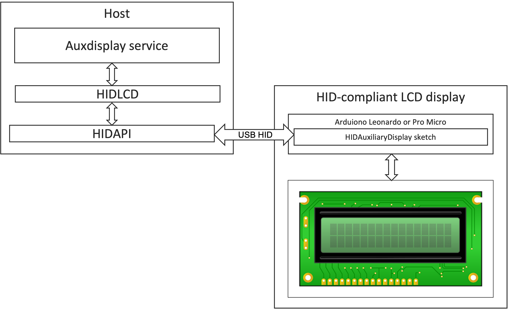

# HID Auxiliary Display Library for Arduino 

This library allows an Arduino board with USB capabilities and connected LCD display to act as 
a HID-compliant Auxiliary Display to the host computer, which can be used for displaying any system output
such as CPU/GPU temperature, fan speed, used memory or any other information.  

This project implements Auxiliary Display Page (0x14) of the 
[HID Usage Table for USB](https://www.usb.org/sites/default/files/hut1_22.pdf) specification. For more
information please read about [USB HID protocol](https://www.usb.org/hid).

## Supported Arduinos 
* Leonardo
* (Pro)Micro

## Supported LCD displays 
* 1602A (Monochrome LCD 16x2)

## Architecture of the solution
The overall architecture of the solution is represented on the image below:

The solution is consisted of 2 parts - the HID-compliant LCD display (this project) and the host. The host part 
is implemented on top of the [HIDAPI library](https://github.com/libusb/hidapi) and contains the auxdisplay service
and the HIDLCD driver.

The architecture of the host can vary depending on your project requirements but should be in compliance with the 
USB HID protocol as defined in the USB HID Usage Table for Auxiliary displays (0x14). 

## Setup & Usage
### Deployment of the 
Setup is very simple. Just clone this repository to Arduino libraries, then upload the .INO sketch from the /examples 
folder, which corresponds to your LCD display model (1602A.ino, for example). Once upload is completed successfully 
you will be able to print textual information from your host to the LCD display.

### Setup of the host drivers
Most popular operating systems do not provide a standard way of connecting HID-compliant displays so additional
drivers and software will have to be deployed on your host to enable the output to the display:

1. [HIDAPI library](https://github.com/libusb/hidapi)               - the low-level cross-platform library implementing 
                                                                      HID protocol
2. [HIDLCD library](https://github.com/abratchik/hidlcd)            - the cross-platform driver of the HID-compliant 
                                                                      LCD.
3. [AuxDisplay service](https://github.com/abratchik/auxdisplay)    - the cross-platform service providing a 
                                                                      simple way to post textual data to the HID-compliant
                                                                      LCD display, including output of system shell
                                                                      commands
                                                       
Please refer to the README pages of these projects for pre-requisites and installation instructions.

## License
[GPL v.3](http://www.gnu.org/copyleft/gpl.html)

